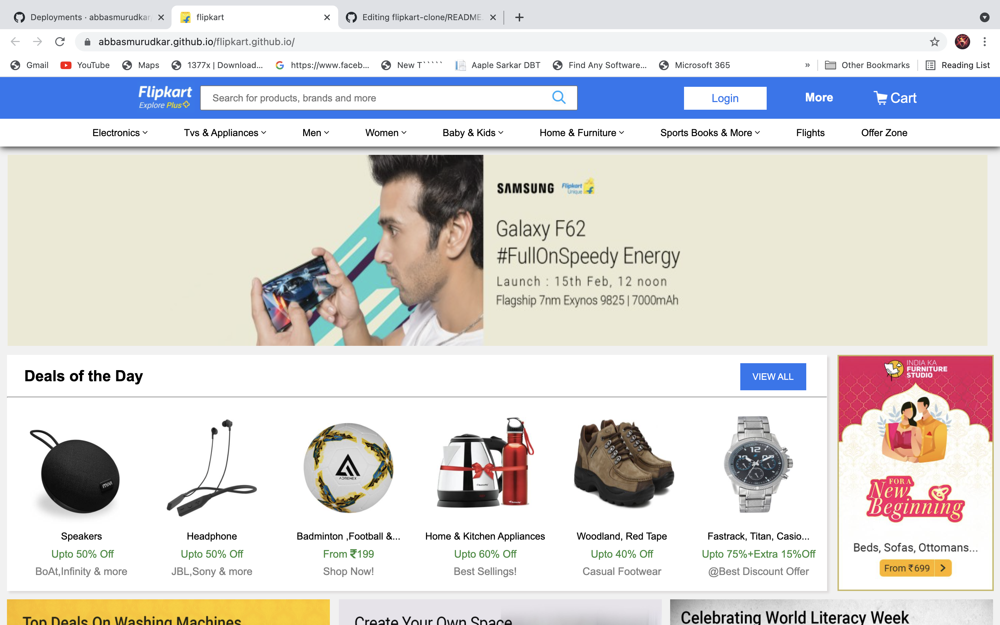

<h2 align="center">FLIPKART PROJECT </h2>

  
<i>
Flipkart which is basically a e-commerce’s website.  Which is build by <strong>Sachin Bansal</strong>.
</i> 
<a href="https://www.flipkart.com">www.flipkart.com</a> 

<h2>Flipkart Clone Project:</h2>

This is a simple clone of webpage flipkart.com using HTML, CSS. Check out the page at
https://github.com/abbasmurudkar/flipkart-clone

<h2>page_facing_up: How to use:</h2>
<ol>
  <li>Download the ZIP file</li>
  <li>Extraxt from any ZIP Extracter</li>
  <li>Open `index.html` in any Browser</li>
  </ol>

## :camera: Screenshot:

## :octocat: Credits:

- ABBAS MURUDKAR (https://www.linkedin.com/in/abbas-murudkar-0084391ba/)

## :memo: Disclaimer:

**_Note: This Flipkart clone project is just for educational purpose._**

